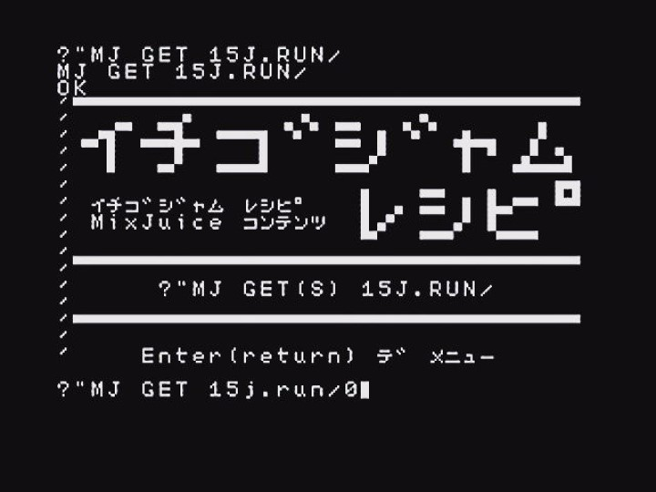

## イチゴジャム レシピ MixJuice コンテンツ



IchigoJam BASIC＋MixJuice で参照できるコンテンツです。\
MixJuice コンテンツがまだまだ少ないので、\
サンプルとしてソースを公開する事にしました。

2019年4月26日より、独自ドメイン **15j.run** へ移しました。\
一部 PHP で処理させるため、[Google App Engine](https://cloud.google.com/appengine/docs/whatisgoogleappengine?hl=ja) を採用しています。\
従来行っていた短縮 URL も含めてあります。

## MixJuice コンテンツの使用方法

次のコマンドで参照できます。
MixJuice 1.2.2 以降および MicJack は GET の代わりに GETS も使用可能です。

```
?"MJ GET 15j.run/
```

## 短縮 URL の使用方法

15j.run/英 1 文字 で使用します。

```
?"MJ GET 15j.run/●
```

MixJuice コンテンツは次のとおりです。

|15j.run  |内容|
|---------|---|
|15j.run/ |イチゴジャム レシピ MixJuice コンテンツ|
|15j.run/D|[MixJuice 向けコンテンツの作成と公開 - 動的コンテンツ生成 サンプル](http://kidspod.club/program/?id=685)|
|15j.run/M|[MixJuice コンテンツ サンプル](https://github.com/fu-sen/ijmj.eu.org)|
|15j.run/S|[MixJuice SSL テスト](https://github.com/fu-sen/mj.15j.run)|
|15j.run/T|短縮 URL メニュー|
|15j.run/U|[MixJuice 向けコンテンツの作成と公開 - User Agent](https://15jamrecipe.jimdo.com/mixjuice/%E3%82%B3%E3%83%B3%E3%83%86%E3%83%B3%E3%83%84%E3%81%AE%E4%BD%9C%E6%88%90%E3%81%A8%E5%85%AC%E9%96%8B/#ua)|

## MixJuice コンテンツ製作 について

[**MixJuice 向けコンテンツの作成と公開 | イチゴジャム レシピ**](https://15jamrecipe.jimdo.com/mixjuice/%E3%82%B3%E3%83%B3%E3%83%86%E3%83%B3%E3%83%84%E3%81%AE%E4%BD%9C%E6%88%90%E3%81%A8%E5%85%AC%E9%96%8B/)
## 関連 Web サイト

**IchigoJam** https://ichigojam.net/ \
**MixJuice** http://mixjuice.shizentai.jp/

**イチゴジャム レシピ** https://15jamrecipe.jimdo.com/

## IchigoJam Advent Calendar 2018 - 10 日目

- [**IchigoJam Advent Calendar 2018 | Qiita**](https://qiita.com/advent-calendar/2018/ichigojam)
- [**翌日 11 日目**<br />円形WS2812Bx2でお手軽工作エモメガネペンダント！ IoTプログラミングで明日を創ろう - 福井市美山中学校会社訪問＆IoT体験 | 福野泰介の一日一創 - create every day](http://fukuno.jig.jp/2331)
- [**前日 9 日目**<br />IchigoJam 画面の画像を撮る方法。 | ふうせん Fu-sen.](https://balloon.gq/2018/12/ichigojam-%E7%94%BB%E9%9D%A2%E3%81%AE%E7%94%BB%E5%83%8F%E3%82%92%E6%92%AE%E3%82%8B%E6%96%B9%E6%B3%95/)
